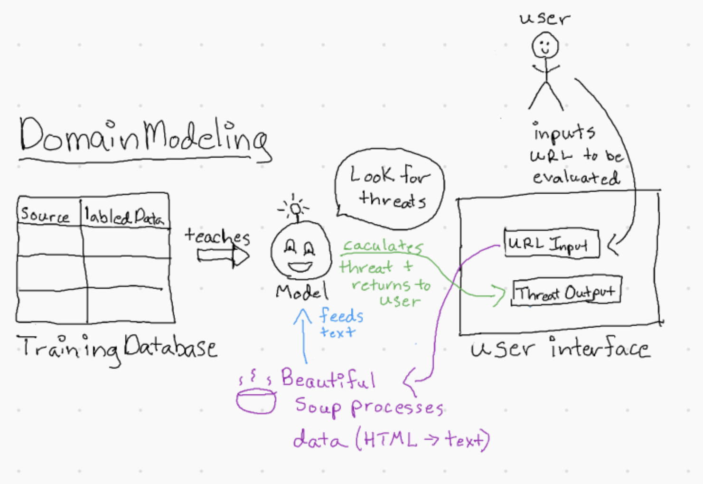
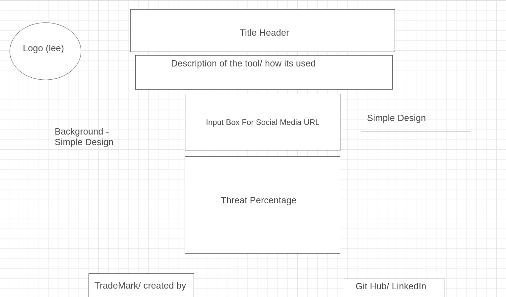

# ThreatDetectives
Build a learning AI that can detect threatening speech. This Repo is to train the Model aswell.

# Developers
- Hexx King
  - https://github.com/HexxKing
- Lee Thomas
  - https://github.com/LeeThomas13
- Ryan Pilon
  - https://github.com/MkayButters
- Taylor Johnson
  - https://github.com/johnson-tay09

# Resources
A list of resources used in this project.
- [Developer Twitter](https://developer.twitter.com/en)
- [Facebook for Developers](https://developers.facebook.com/docs/facebook-login/access-tokens)
- [Beautiful Soup](https://www.crummy.com/software/BeautifulSoup/)

# References 

A list of references we used to help build this project. 

- [Text classification using the Bag Of Words Approach with NLTK and Scikit Learn on Medium](https://medium.com/swlh/text-classification-using-the-bag-of-words-approach-with-nltk-and-scikit-learn-9a731e5c4e2f)
- [Natural Language Processing Tutorial on Kaggle](https://www.kaggle.com/learn/natural-language-processing)
- [HateLab on Twitter](https://developer.twitter.com/en/use-cases/success-stories/hatelab)
- [Sentiment Analysis 101: How Sprout’s Data Science Team Built a Hybrid Model](https://sproutsocial.com/insights/sentiment-analysis/)
- [A guide to being an ethical online investigator](https://www.technologyreview.com/2021/01/14/1015931/how-to-be-an-ethical-online-investigator-activist)

# Trello

[User Stories/Workflow](https://trello.com/b/MmLoe68O/threatdetectives)

# Domain Model

# Wireframe

